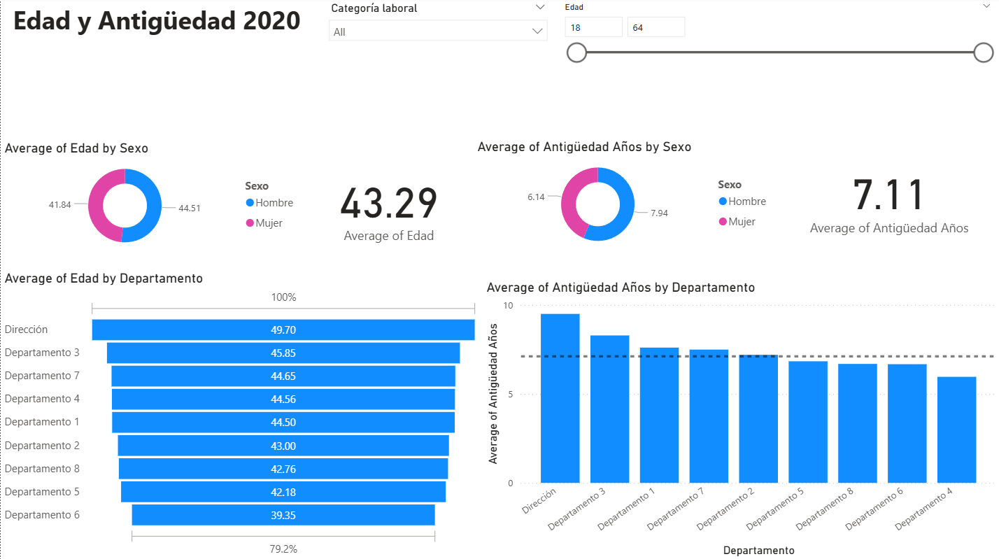
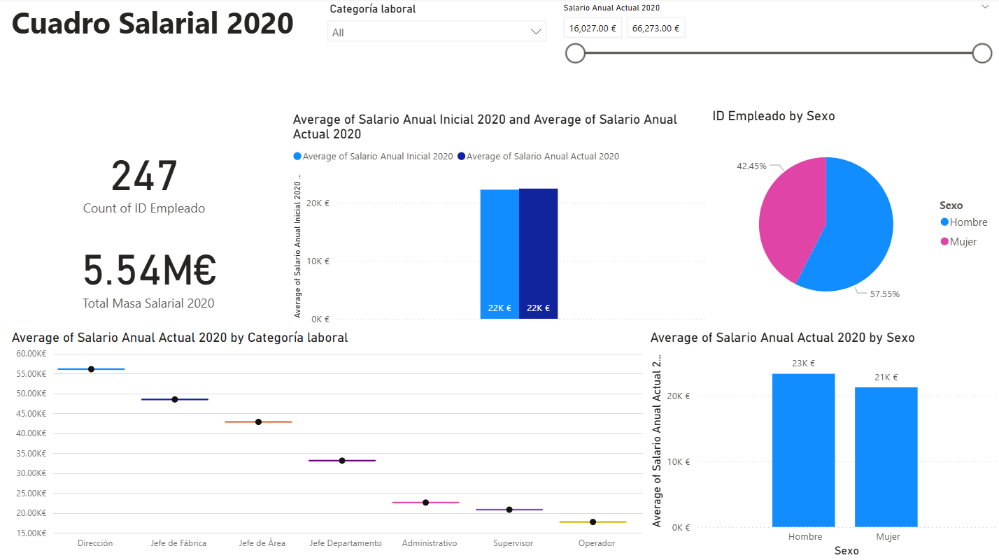

# Dashboard Análisis de RRHH - Proyecto Final

Dashboard desarrollado como proyecto del bootcamp de Data Analytics de Datahack (IBM).
Analiza datos de 801 empleados incluyendo edad, antigüedad, categoría laboral y cuadro salarial 2020.

## Dataset
Fuente: Base de datos interna del caso práctico HRA (Datahack)
Formato: Excel con 3 hojas de datos: empleados, evaluaciones y absentismo.
Incluye datos demográficos, antigüedad, categoría laboral, salarios y métricas de evaluación.

## Herramientas
- Power BI Desktop
- Power Query para limpieza y modelado de datos
- DAX para métricas y KPIs calculados

## Páginas del dashboard

**Edad y Antigüedad:** edad media de 43,29 años y antigüedad media de 7,11 años.
Desglose por sexo y por departamento. Filtros por categoría laboral y rango de edad.

**Cuadro Salarial:** masa salarial total de 5,54M€ para 247 empleados.
Comparativa de salario inicial vs actual, distribución por sexo y rango salarial por categoría laboral.

## Filtros globales
Categoría laboral y rango salarial aplicables a todas las páginas.

## Capturas

